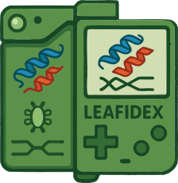

# leafidex
 An annotation pipeline for transcript splicing events (i.e. from [leafcutter](https://davidaknowles.github.io/leafcutter/)), formerly TheSpliceGirls
## Installation
```sh
pip install -e git+https://github.com/atokolyi/leafidex.git#egg=leafidex
```
## Usage
Load the library
```py
import leafidex as ldex
```
Download/update the annotation cache (with desired gencode version, default is 46).
```py
ldex.update_cache(gencode=46)
```
Import test data or a vector of splice junction IDs (e.g. in format "10:112426859:112427218:clu_12345_+")
```py
from importlib_resources import files
splices = files('leafidex').joinpath('sample.txt').read_text().rstrip().split('\n')
```
Annotate splice events
```py
annots = ldex.annotate(splices)
```

## Description of output
The above function (`annotate`) will return a dataframe with the following columns:
Name | Description
--- | ---
ID | The original identifier of the splice event
chr | Chromosome ID of the splice event, will start with "chr"
start | Splice start location (unstranded, i.e. always less than `end`)
end | Splice end location (unstranded, i.e. always greater than `start`)
clu | Cluster ID
strand | Strand (if unstranded, will be `*`)
start_stranded | Splice start location (stranded, i.e. if negative strand, start_stranded>end_stranded)
end_stranded | Splice end location (stranded, i.e. if negative strand, end_stranded<start_stranded)
gene_full_match | Boolean, if the splice event is fully contained within a gene body
gene_id | Gene ID of gene(s), (column-separated if multiple) the splice event falls within
gene_name | Gene symbol as above
gene_type | Gene type as above
splice_antisense | Boolean, true if the only matching gene is on the opposite strand of the splice event
range | Splice event coordinates in GRanges format
overlaps_exon | Boolean, if the transcript splicing event excises (fully or in part) an exon
overlaps_cds | 	Boolean, if the transcript splicing event excises (fully or in part) a CDS (a subset of above)
p5_exon_overlap	| Boolean, if the 5' splice donor matches a known exon boundary
p3_exon_overlap	| Boolean, if the 3' splice acceptor matches a known exon boundary
p5_and_p3_exon_overlap | Boolean, if both p3 and p5 are true
p5_or_p3_exon_overlap | Boolean, if either p3 or p5 are true (for a more lenient 'known' splice event definition)
unipLocTransMemb | Boolean, if the splice event excises a known transmembrane domain (from uniprot)
unipLocCytopl | Boolean, if the splice event excises a known cytoplasmic domain (from uniprot)
unipLocExtra | Boolean, if the splice event excises a known extracellular domain (from uniprot)
unipLocSignal | Boolean, if the splice event excises a known signal peptide domain (from uniprot)
unipDomain | Name of uniprot domains (comma-separated) that are excised by the splice event, blank if none
pfamDomain | Name of pfam domains (comma-separated) that are excised by the splice event, blank if none